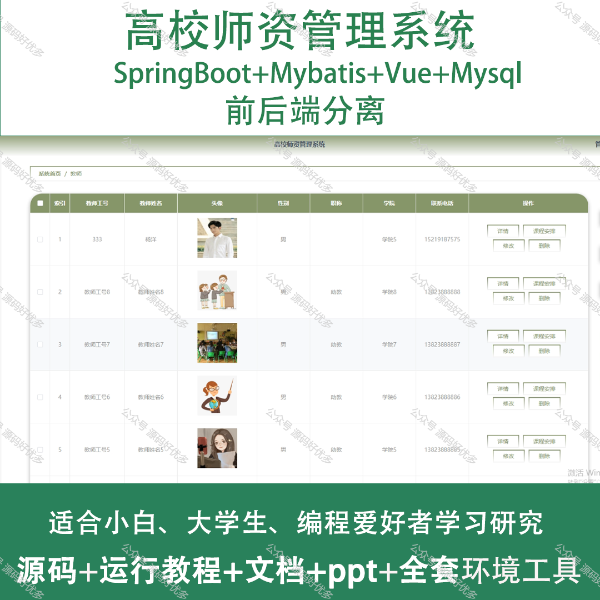
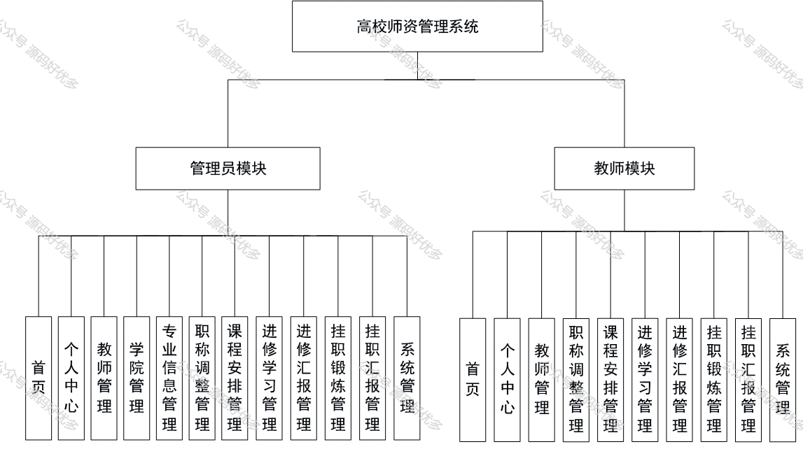
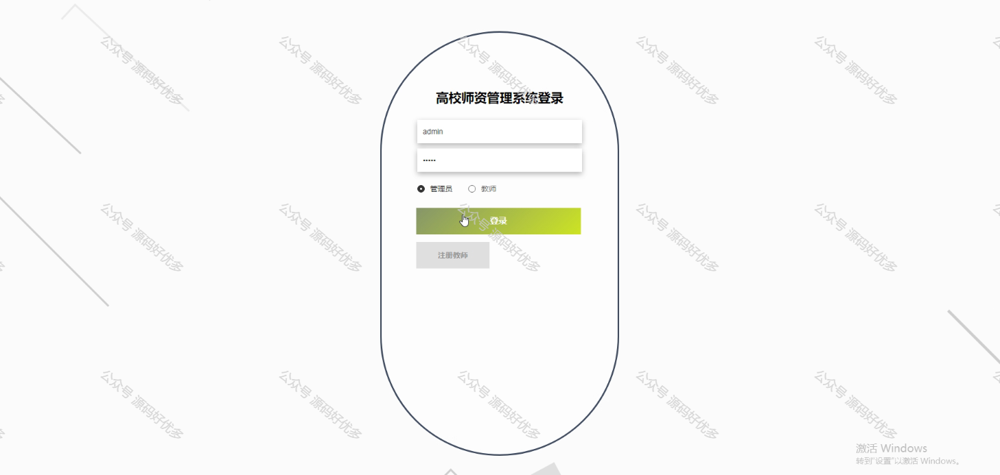
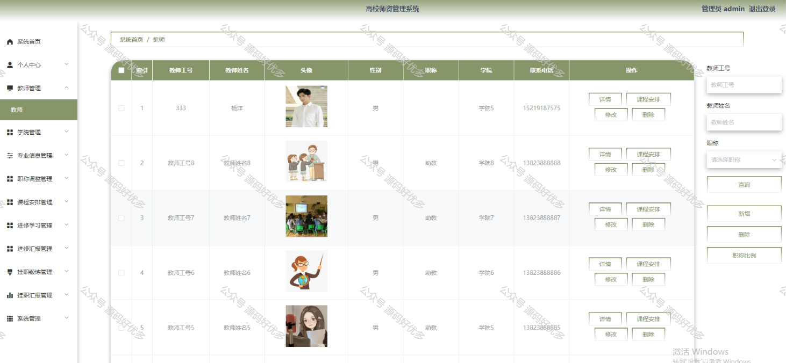
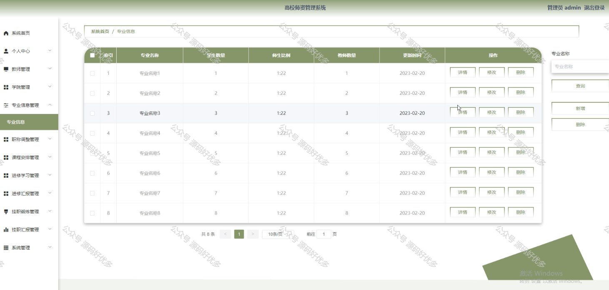
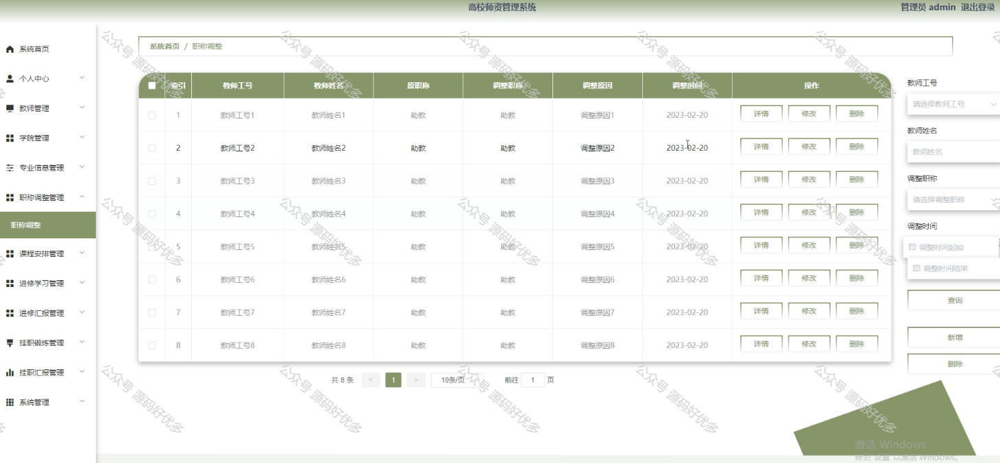
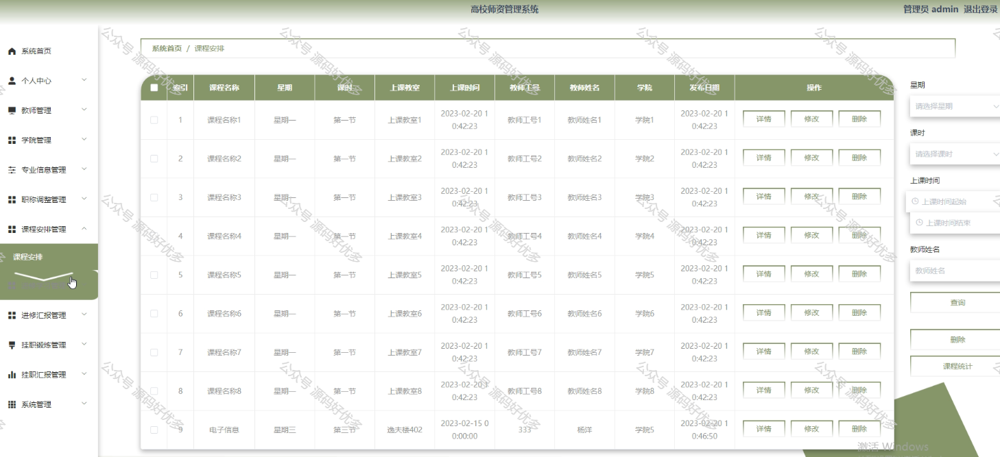
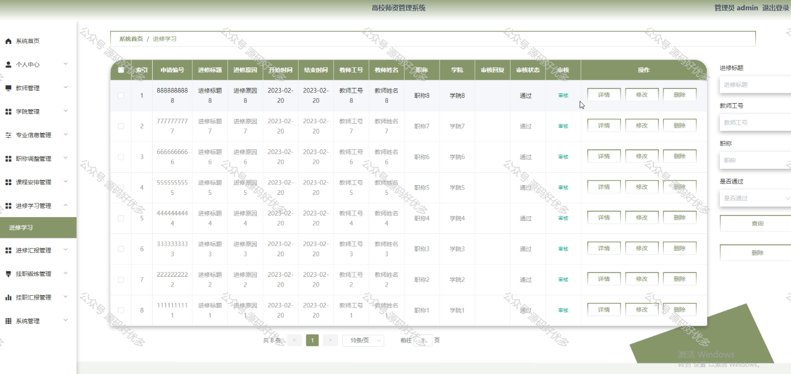
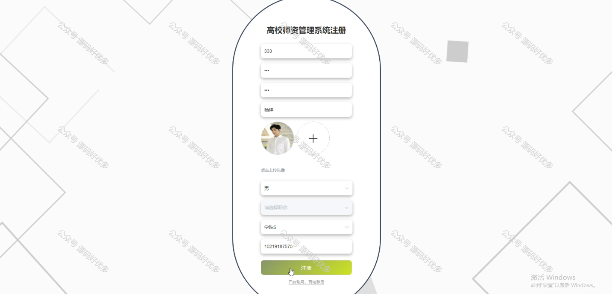
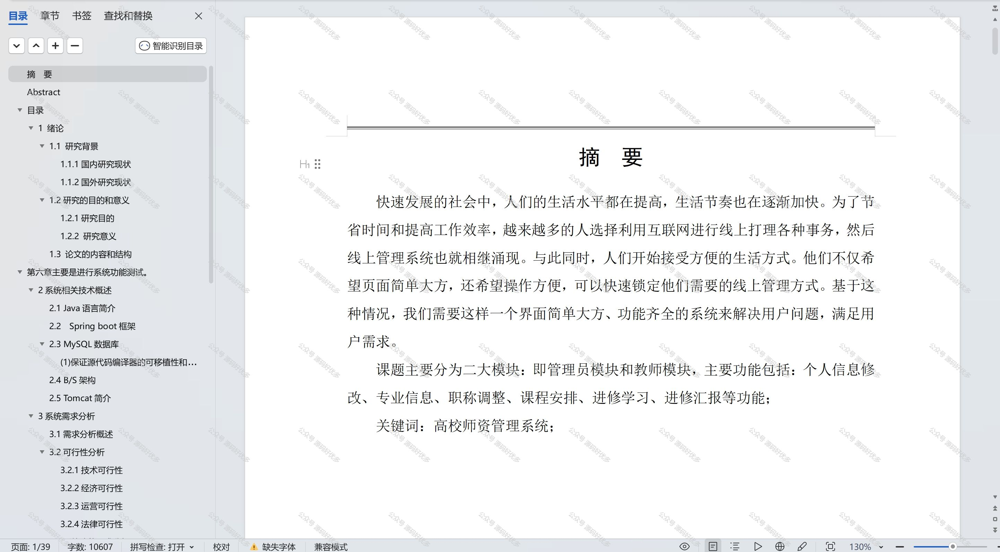

 
## 查看主页获取源码

### 一、作品包含

源码+数据库+设计文档万字+PPT+全套环境和工具资源+部署教程

### 二、项目技术

前端技术：Html、Css、Js、Vue、Element-ui

数据库：MySQL

后端技术：Java、Spring Boot、MyBatis

  

### 三、运行环境

开发工具：IDEA/eclipse

数据库：MySQL5.7

数据库管理工具：Navicat10以上版本

环境配置软件： JDK1.8+Maven3.6.3

前端Nodejs：14

### 四、项目介绍
项目编号：springbootA170

高校师资管理系统是为了优化教师资源配置，提升教学管理水平，保障教学质量而设计的。系统以高等教育的快速发展为背景，紧密结合高校师资队伍建设的实际需求，通过信息化手段实现功能的集成，旨在为高校提供一个科学、规范、高效的师资管理平台，从而促进教师个人成长与学校整体教育质量的提升。

系统分为管理员和教师
管理员的功能：首页、个人中心、教师管理、学院管理、专业信息管理、职称调整管理、课程安排管理、进修学习管理、进修汇报管理、挂职锻炼管理、挂职汇报管理和系统管理。
教师的功能：首页、个人中心、教师管理、职称调整管理、课程安排管理、进修学习管理、进修汇报管理、挂职锻炼管理、挂职汇报管理、系统管理。

### 五、运行截图

  
